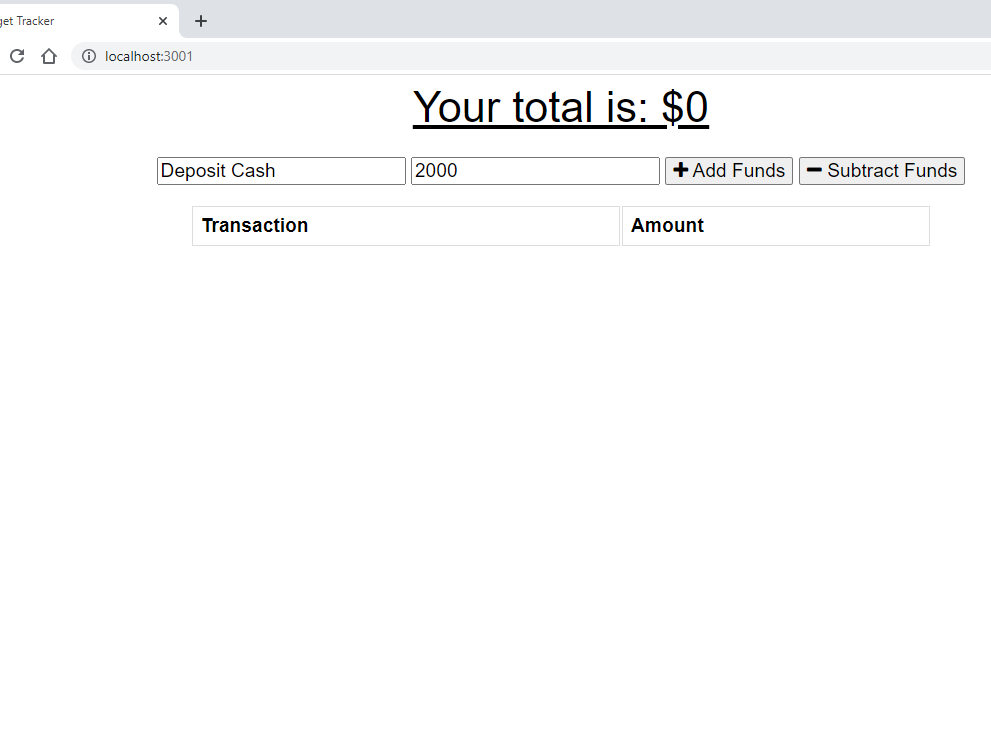

# Budget-Tracker
### PWA (Progressive Web Application)
## Purpose:heavy_exclamation_mark:
 To update an existing budget tracker application to allow for offline access and functionality <br>
 
### USER STORY:
`"AS AN avid traveler
I WANT to be able to track my withdrawals and deposits
 with or without a data/internet connection 
SO THAT my account balance is accurate when I am traveling."` 


When running `npm start`, the first page showed this:
 <br>


   ## Table of Contents::mag:

   1. [ HEROKU DEPLOY ](#heroku)
   2. [ Installation ](#installation)
   3. [ Usage ](#usage)
   4. [ Contributing ](#contributing)

   ## Heroku:
   [Click Here]()

   ## Installation:hammer:

   To install dependancies, run the following commands:

     ```
     `npm install` to create node_modules
     ```
     ```
     `npm i mongoose`
     ```
     ```
     run `mongod` to start MONGODB service 
     ```
     ```
     `npm start` to run app in server
     ```
     ```
     `npm i heroku` and `heroku create` to create URL of app in Heroku.com
     ```
     ```
     `npm i express`
     ```

    

   ## Usage:

    For usage, please make sure to add comments and submit merge requests to Github.com.
  

   ## Contributing:
   Please be kind and professional when adding to or accessing this repository. Thank you!
  [More on Contribution Guidelines](https://github.com/verokoles/readme-generator/blob/f57cf6a98bf276960885496059df4b039247c985/contributing.md)
  